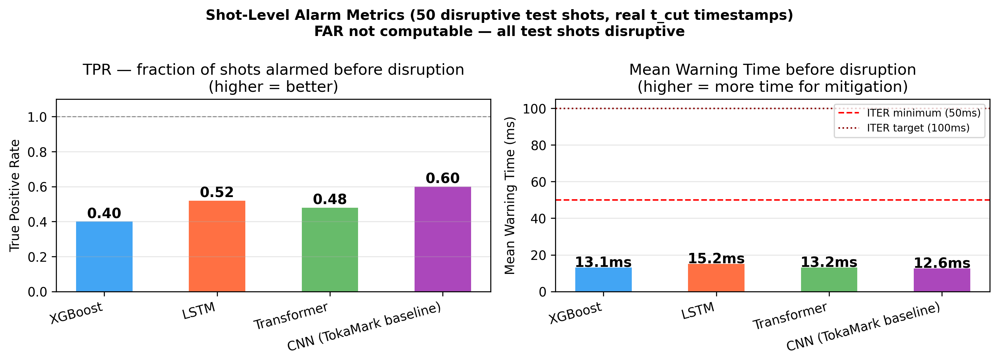
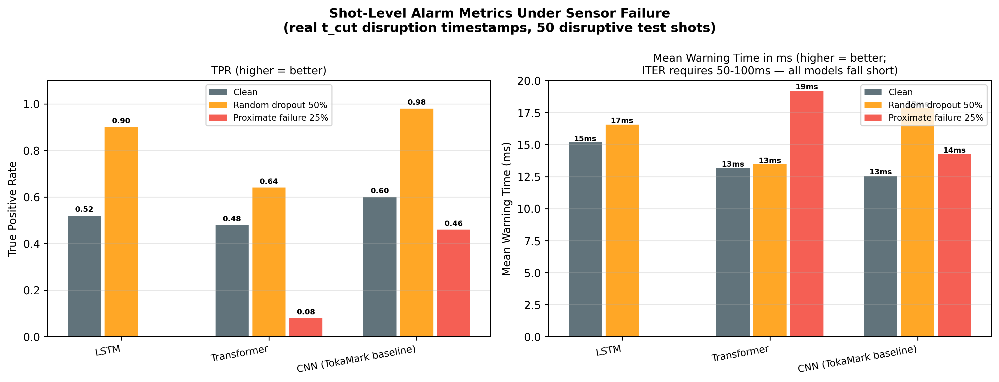
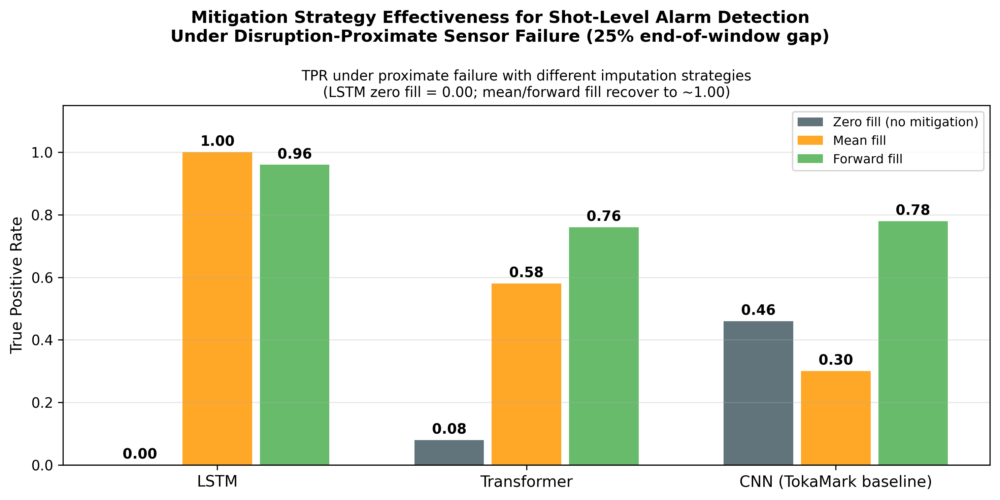

# Benchmarking Sensor Robustness in Plasma Diagnostic Models

**Author:** Neerav Gupta  
**Paper:** Preprint available on [GitHub](https://github.com/Neerav-Gupta/tokamark-robustness/blob/main/paper/main.pdf)\
**Data & Checkpoints:** [HuggingFace Dataset](https://huggingface.co/datasets/Neerav-Gupta/tokamark-robustness-data)

---

## Overview

This repository contains the code, results, and figures for the first systematic robustness benchmark of plasma diagnostic ML models under realistic sensor failure, built on the [TokaMark benchmark](https://arxiv.org/abs/2602.10132) dataset of 11,573 MAST tokamak shots.

We evaluate four model architectures (XGBoost, LSTM, Transformer, and the TokaMark CNN baseline) across six physically-motivated failure scenarios and three mitigation strategies, and introduce the Robustness Score (RS) for standardized cross-architecture comparison. We also compute shot-level alarm metrics using ground-truth disruption timestamps from FAIR-MAST, revealing that the optimal imputation strategy for NRMSE and alarm detection are not the same.

---

## Key Findings

**NRMSE robustness:**
- Disruption-proximate sensor failure is catastrophic for sequence models (LSTM: +212% NRMSE) while statistical models remain comparatively robust (XGBoost: +37%)
- Forward-fill imputation nearly eliminates degradation from random dropout for sequence models (LSTM: +57% → ~0%)
- Plasma current is the single most critical diagnostic signal (+73% to +140% degradation upon removal)
- Front-loaded acquisition gaps — the dominant natural failure mode in MAST — cause negligible degradation across all models
- The TokaMark CNN baseline achieves RS = 0.764, nearly identical to the Transformer (0.765)

**Shot-level alarm metrics:**
- Under clean conditions, CNN achieves the highest TPR (0.60); all models produce mean warning times of 12–15ms, well below the ITER minimum of 50ms
- Under disruption-proximate sensor failure, LSTM alarm detection collapses to TPR = 0.00 with zero-fill imputation
- Mean-fill imputation recovers LSTM alarm detection from TPR = 0.00 to TPR = 1.00 — a reversal of its effect on NRMSE

---

## Results

| Model | Clean NRMSE | Robustness Score (RS) | Clean TPR | TPR (proximate 25%, zero-fill) |
|---|---|---|---|---|
| XGBoost | 0.494 | 0.841 | 0.40 | — |
| LSTM | 0.496 | 0.808 | 0.52 | 0.00 |
| Transformer | 0.470 | 0.765 | 0.48 | 0.08 |
| CNN (TokaMark baseline) | 0.528 | 0.764 | 0.60 | 0.46 |

---

## Figures


*NRMSE under random dropout, channel ablation, and temporal gap (front) across all four architectures and three imputation strategies.*


*NRMSE degradation when each diagnostic category is completely removed. Plasma current dominates; CNN is uniquely sensitive to active coil removal.*


*Simultaneous failure of physically related signal groups, motivated by the observed r = 1.000 NaN correlation between interferometer and D-alpha in MAST data.*


*Stark asymmetry between front gap (negligible for LSTM/XGBoost) and proximate failure (catastrophic for LSTM).*


*Forward fill dominates for dropout; no strategy resolves proximate failure under NRMSE evaluation.*


*XGBoost achieves the highest RS (0.841); Transformer and CNN are nearly identical (0.765 vs 0.764).*


*TPR and mean warning time on 50 disruptive test shots using real t_cut timestamps. All models fall short of the ITER 50ms minimum.*


*LSTM TPR collapses to 0.00 under proximate failure; CNN maintains partial detection (0.46).*


*Mean-fill and forward-fill both recover LSTM alarm detection to ~1.00 under proximate failure — the opposite of their NRMSE effect.*

---

## Repository Structure

```
tokamark-robustness/
├── scripts/
│   ├── config.py                    # Central experiment configuration
│   ├── collect_data.py              # Data collection from TokaMark S3
│   ├── corruption.py                # Corruption + mitigation functions
│   ├── feature_engineering.py       # Statistical feature extraction
│   ├── data_loader.py               # Data loading utilities
│   ├── train_xgboost.py             # XGBoost training + robustness evaluation
│   ├── train_lstm.py                # LSTM training + robustness evaluation
│   ├── train_transformer.py         # Transformer training + robustness evaluation
│   ├── train_cnn_baseline.py        # TokaMark CNN baseline training + evaluation
│   ├── compute_alarm_metrics.py     # Shot-level alarm metrics (t_cut timestamps)
│   └── analyze_results.py           # All 9 figure generation
├── results/
│   ├── xgboost_results.json
│   ├── lstm_results.json
│   ├── transformer_results.json
│   ├── cnn_results.json
│   ├── shot_level_metrics.json
│   ├── alarm_under_corruption.json
│   └── alarm_mitigation_proximate.json
├── plots/
│   ├── fig1_degradation_curves.png
│   ├── fig2_channel_importance.png
│   ├── fig3_correlated_failure.png
│   ├── fig4_proximate_comparison.png
│   ├── fig5_mitigation_effectiveness.png
│   ├── fig6_robustness_scores.png
│   ├── fig7_alarm_metrics.png
│   ├── fig8_alarm_under_corruption.png
│   └── fig9_alarm_mitigation.png
├── paper/
│   ├── main.tex
│   ├── references.bib
│   └── main.pdf
├── README.md
└── LICENSE
```

---

## Data & Checkpoints

Full data arrays (~25 GB) and trained model checkpoints are available on HuggingFace:

**[huggingface.co/datasets/Neerav-Gupta/tokamark-robustness-data](https://huggingface.co/datasets/Neerav-Gupta/tokamark-robustness-data)**

Contents:
- `data/` — pre-collected `.npy` arrays and `.pkl` sample files for all splits
- `checkpoints/` — trained model weights (`xgboost_clean.pkl`, `lstm_clean.pt`, `transformer_clean.pt`, `cnn_clean.pt`)
- `results/` — all result JSON files

---

## Reproducing Results

### Requirements

```bash
# Clone this repo and TokaMark
git clone https://github.com/Neerav-Gupta/tokamark-robustness.git
git clone https://github.com/UKAEA-IBM-STFC-Fusion-FMs/tokamark.git

# Set up environment (inherits system PyTorch/CUDA if available)
python -m venv venv --system-site-packages
source venv/bin/activate
pip install xgboost scikit-learn pandas xarray \
    "zarr<3.0" s3fs==2024.2.0 botocore==1.34.0 fsspec==2024.2.0 \
    matplotlib seaborn tqdm huggingface_hub

# Install TokaMark (patch zarr compatibility if needed)
cd tokamark
find src/ -name "*.py" -exec sed -i \
    's/zarr\.storage\.FsspecStore/zarr.storage.FSStore/g; \
     s/zarr\.storage\.LocalStore/zarr.storage.DirectoryStore/g' {} \;
pip install . && cd ..
```

### Run experiments

```bash
# Option A — Download pre-collected data from HuggingFace (recommended)
python -c "
from huggingface_hub import snapshot_download
snapshot_download(
    repo_id='Neerav-Gupta/tokamark-robustness-data',
    repo_type='dataset',
    local_dir='fusion_research/data',
)
"

# Option B — Collect data from scratch (~2 hours, streams from UKAEA S3)
python scripts/collect_data.py

# Train all four models and run robustness evaluation
python scripts/train_xgboost.py
python scripts/train_lstm.py
python scripts/train_transformer.py
python scripts/train_cnn_baseline.py

# Compute shot-level alarm metrics
python scripts/compute_alarm_metrics.py

# Generate all 9 figures
python scripts/analyze_results.py
```

---

## Citation

If you use this work please cite:

```bibtex
@misc{gupta2026tokamark_robustness,
  title  = {Benchmarking Sensor Robustness in Plasma Diagnostic Models:
            A Systematic Evaluation on TokaMark},
  author = {Gupta, Neerav},
  year   = {2026},
  note   = {Preprint, available at
            https://github.com/Neerav-Gupta/tokamark-robustness}
}
```

Please also cite the TokaMark benchmark:

```bibtex
@article{rousseau2026tokamark,
  title   = {TokaMark: A Comprehensive Benchmark for MAST Tokamak Plasma Models},
  author  = {Rousseau, C{\'e}cile and Jackson, Samuel and
             Ordonez-Hurtado, Rodrigo H. and Amorisco, Nicola C. and
             Boschi, Tobia and Holt, George K. and Loreti, Andrea and
             Sz{\'e}kely, Eszter and Whittle, Alexander and Agnello, Adriano
             and Pamela, Stanislas and Pascale, Alessandra and Akers, Robert
             and Bernabe Moreno, Juan and Thorne, Sue and Zayats, Mykhaylo},
  journal = {arXiv preprint arXiv:2602.10132},
  year    = {2026}
}
```

---

## License

This project is licensed under the MIT License — see the [LICENSE](LICENSE) file for details.