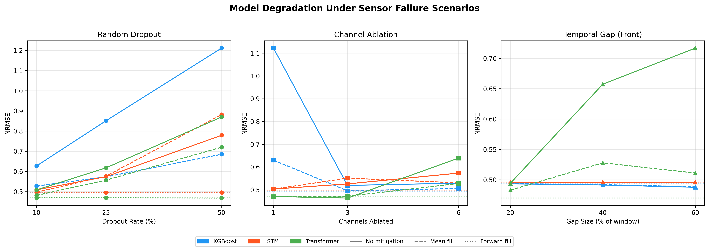
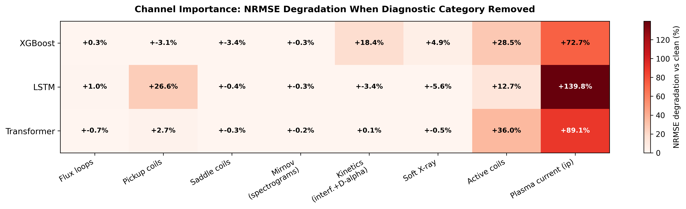
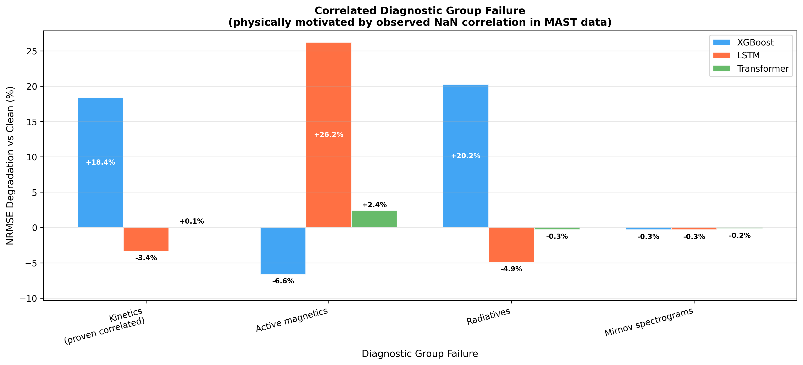
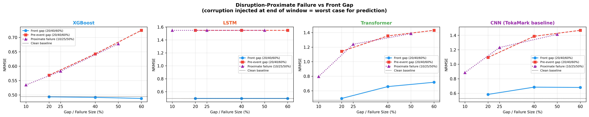
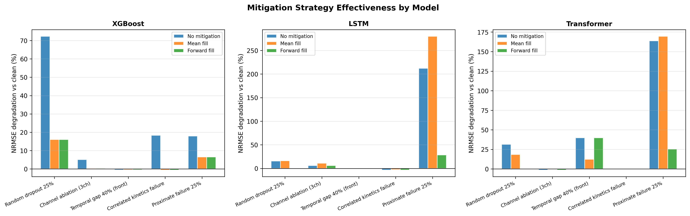
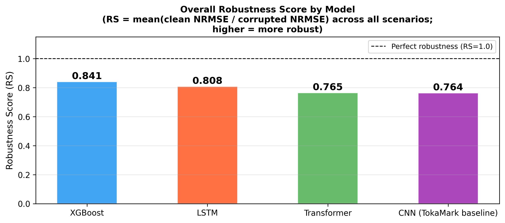

# Benchmarking Sensor Robustness in Plasma Diagnostic Models

**Author:** Neerav Gupta  
**Paper:** Preprint available on [GitHub](https://github.com/Neerav-Gupta/tokamark-robustness/blob/main/paper/main.pdf)\
**Data & Checkpoints:** [HuggingFace Dataset](https://huggingface.co/datasets/Neerav-Gupta/tokamark-robustness-data)

## Overview

This repository contains code and results for the first systematic robustness benchmark of plasma diagnostic ML models under realistic sensor failure, using the [TokaMark benchmark](https://arxiv.org/abs/2602.10132) dataset of 11,573 MAST tokamak shots.

We evaluate three model architectures (XGBoost, LSTM, Transformer) across six physically-motivated failure scenarios and three mitigation strategies, introducing a Robustness Score (RS) for standardized cross-architecture comparison.

## Key Findings

- Disruption-proximate sensor failure causes catastrophic degradation in sequence models (LSTM: +212% NRMSE) while statistical models remain comparatively robust (XGBoost: +37%)
- Forward-fill imputation nearly eliminates degradation from random dropout for sequence models (LSTM: +57% → ~0%)
- Plasma current is the single most critical diagnostic signal (+73% to +140% degradation upon removal)
- Front-loaded acquisition gaps — the dominant natural failure mode in MAST data — cause negligible degradation in all models

## Results

| Model | Clean NRMSE | Robustness Score |
|---|---|---|
| XGBoost | 0.494 | 0.841 |
| LSTM | 0.496 | 0.808 |
| Transformer | 0.470 | 0.765 |

## Figures

 






## Repository Structure

```
tokamark-robustness/
├── scripts/
│   ├── config.py                  # Central experiment configuration
│   ├── collect_data.py            # Data collection from TokaMark S3
│   ├── corruption.py              # Corruption + mitigation functions
│   ├── feature_engineering.py     # Statistical feature extraction
│   ├── data_loader.py             # Data loading utilities
│   ├── train_xgboost.py           # XGBoost training + evaluation
│   ├── train_lstm.py              # LSTM training + evaluation
│   ├── train_transformer.py       # Transformer training + evaluation
│   └── analyze_results.py         # Figure generation
├── results/
│   ├── xgboost_results.json
│   ├── lstm_results.json
│   └── transformer_results.json
├── plots/
│   ├── fig1_degradation_curves.png
│   ├── fig2_channel_importance.png
│   ├── fig3_correlated_failure.png
│   ├── fig4_proximate_comparison.png
│   ├── fig5_mitigation_effectiveness.png
│   └── fig6_robustness_scores.png
├── README.md
└── LICENSE
```

## Data & Checkpoints

Full data arrays (~25GB) and trained model checkpoints are available on HuggingFace:

**[huggingface.co/datasets/Neerav-Gupta/tokamark-robustness-data](https://huggingface.co/datasets/Neerav-Gupta/tokamark-robustness-data)**

## Reproducing Results

### Requirements

```bash
# Clone this repo and TokaMark
git clone https://github.com/Neerav-Gupta/tokamark-robustness.git
git clone https://github.com/UKAEA-IBM-STFC-Fusion-FMs/tokamark.git

# Set up environment
python -m venv venv --system-site-packages
source venv/bin/activate
pip install torch xgboost scikit-learn zarr \
    s3fs==2024.2.0 botocore==1.34.0 fsspec==2024.2.0 \
    matplotlib seaborn tqdm pandas numpy

cd tokamark && pip install -e . && cd ..
```

### Run experiments

```bash
# Option A — Download pre-collected data from HuggingFace (recommended)
python -c "
from huggingface_hub import snapshot_download
snapshot_download(
    repo_id='Neerav-Gupta/tokamark-robustness-data',
    repo_type='dataset',
    local_dir='fusion_research/data',
    ignore_patterns=['checkpoints/*']
)
"

# Option B — Collect data from scratch (~2 hours, streams from UKAEA S3)
python scripts/collect_data.py

# Train models and run all experiments
python scripts/train_xgboost.py
python scripts/train_lstm.py
python scripts/train_transformer.py

# Generate all figures
python scripts/analyze_results.py
```

## Citation

If you use this work please cite:

```bibtex
@misc{gupta2026tokamark_robustness,
  title   = {Benchmarking Sensor Robustness in Plasma Diagnostic Models:
             A Systematic Evaluation on TokaMark},
  author  = {Gupta, Neerav},
  year    = {2026},
  note    = {Preprint, available at https://github.com/Neerav-Gupta/tokamark-robustness}
}
```

Please also cite the TokaMark benchmark:

```bibtex
@article{rousseau2026tokamark,
  title   = {TokaMark: A Comprehensive Benchmark for MAST Tokamak Plasma Models},
  author  = {Rousseau, C{\'e}cile and Jackson, Samuel and
             Ordonez-Hurtado, Rodrigo H. and Amorisco, Nicola C. and
             Boschi, Tobia and Holt, George K and Loreti, Andrea and
             Sz{\'e}kely, Eszter and Whittle, Alexander and Agnello, Adriano
             and Pamela, Stanislas and Pascale, Alessandra and Akers, Robert
             and Bernabe Moreno, Juan and Thorne, Sue and Zayats, Mykhaylo},
  journal = {arXiv preprint arXiv:2602.10132},
  year    = {2026}
}
```

## License

This project is licensed under the MIT License — see the [LICENSE](LICENSE) file for details.